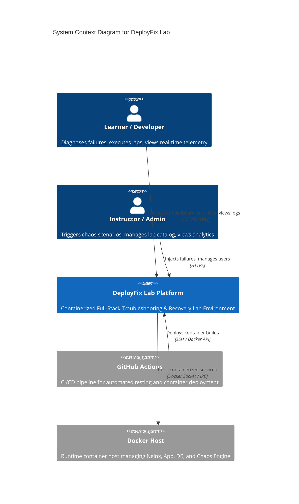
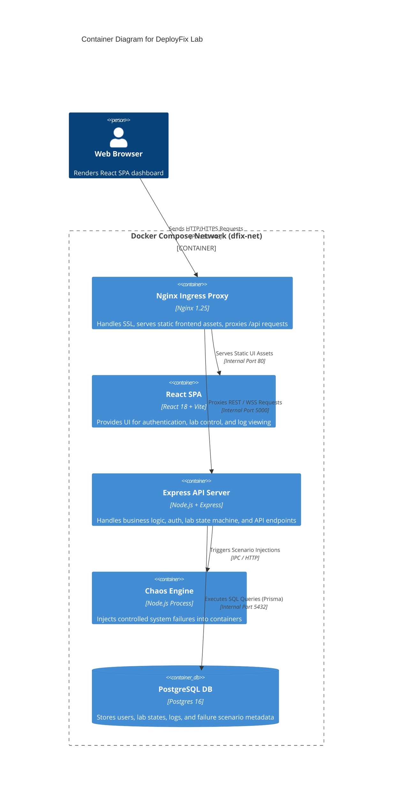

# 01 — System Architecture Specification

---

## Document Metadata

| Field               | Value                                                             |
|---------------------|-------------------------------------------------------------------|
| **Document Name**   | System Architecture Specification                                 |
| **Document ID**     | DFIX-ARCH-001                                                     |
| **Version**         | 1.0.0                                                             |
| **Status**          | Approved                                                          |
| **Owner**           | Principal Systems Architect                                       |
| **Reviewer**        | Technical Lead, DevOps Lead                                       |
| **Classification**  | Internal — Confidential                                           |
| **Created Date**    | 2026-08-02                                                        |
| **Last Updated**    | 2026-08-06                                                        |
| **Project**         | DeployFix Lab                                                     |
| **Project Code**    | DFIX                                                              |

---

# 1. Executive Architecture Summary

**DeployFix Lab** is designed as a production-grade, multi-tier containerized platform purpose-built for full-stack software development, cloud deployment, telemetry monitoring, controlled chaos engineering, and recovery practice.

The system leverages a modular, decoupled tier structure:
* **Client / Presentation Layer:** Single Page Application (SPA) built with React 18, TypeScript, and Vite.
* **Ingress / Reverse Proxy Layer:** Nginx Web Server serving static frontend assets, managing SSL termination, rate limiting, and routing API traffic.
* **Application / Business Logic Layer:** RESTful Micro-service API built with Node.js, Express.js, and TypeScript.
* **Data Storage Layer:** PostgreSQL Relational Database with Prisma ORM.
* **Chaos Engineering & Failure Injection Engine:** Dedicated sub-system for injecting controlled environment breakages (DNS failures, connection timeouts, schema mismatches, OOM conditions).
* **Observability Suite:** Structured JSON logger (Winston), health probes (`/health/liveness`, `/health/readiness`), and WebSocket log streaming.

---

# 2. High-Level System Context (C4 Level 1 Diagram)

---

# 3. System Container Architecture (C4 Level 2 Diagram)

---

# 4. Architectural Principles

1. **Strict Separation of Concerns:** Frontend UI, Backend API, Proxy Ingress, and Database operate in isolated, zero-dependency containers.
2. **Configuration via Environment Variables:** All runtime configurations follow 12-Factor App methodology (`.env` injected into Docker containers).
3. **Stateless Backend Processing:** Access state is maintained via JWT tokens, allowing backend containers to scale or restart seamlessly.
4. **Idempotent Failure Injection:** Chaos injections modify runtime state in isolated container layers without permanently corrupting base image files or host storage.
5. **Observability First:** Every system transaction emits structured logs with correlation IDs for end-to-end request tracing.

---

# 5. Core Operational Modes

| Mode | Target User | State | Description |
|---|---|---|---|
| **Normal Operation** | Learner / User | `OPERATIONAL` | All services operating normally; standard CRUD functionality available. |
| **Chaos Injection** | Instructor / Admin | `FAILED_INJECTED` | Failure vector active (e.g., DB connection string altered, Nginx port changed). |
| **Troubleshooting** | Learner | `DIAGNOSING` | User inspects logs, container health, network connectivity to isolate root cause. |
| **Verification** | Automated System | `VERIFYING` | Automated probe executes diagnostic tests to validate recovery. |
