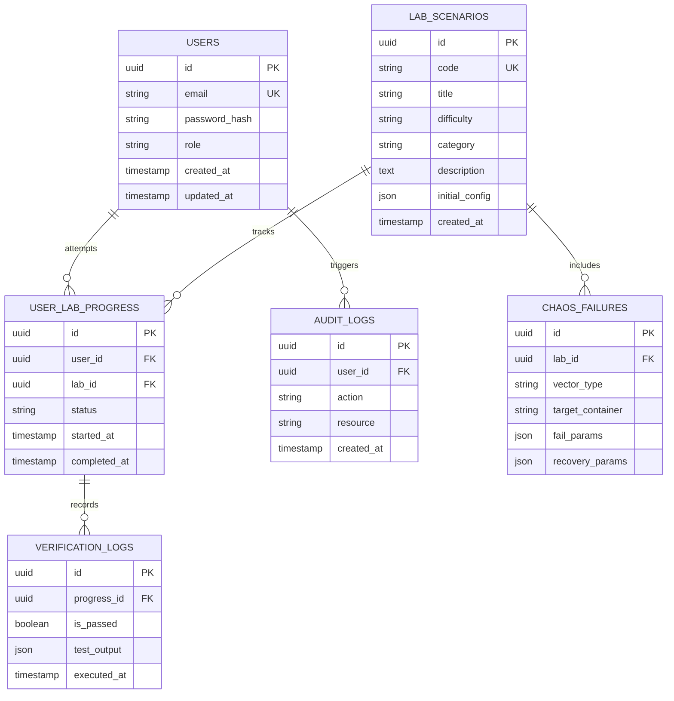

# 04 — Database Architecture Specification

---

## Document Metadata

| Field               | Value                                                             |
|---------------------|-------------------------------------------------------------------|
| **Document Name**   | Database Architecture Specification                               |
| **Document ID**     | DFIX-ARCH-004                                                     |
| **Version**         | 1.0.0                                                             |
| **Status**          | Approved                                                          |
| **Owner**           | Database Architect                                                |
| **Reviewer**        | Technical Lead, Backend Lead                                      |
| **Classification**  | Internal — Confidential                                           |
| **Created Date**    | 2026-08-02                                                        |
| **Last Updated**    | 2026-08-06                                                        |
| **Project**         | DeployFix Lab                                                     |
| **Project Code**    | DFIX                                                              |

---

The persistence tier of **DeployFix Lab** utilizes **PostgreSQL** as its relational database engine, managed through **Prisma ORM** (`prisma/schema.prisma`, Prisma Migrate, Prisma Client).

### Dual-Environment Architecture:
* **Local Development Environment:** Uses a **Dockerized PostgreSQL** container (`postgres:16-alpine`) within the Docker Compose network to support hands-on local container debugging and chaos failure simulation.
* **Cloud / Staging / Production Environments:** Uses **Supabase PostgreSQL** as the managed cloud database provider, accessed securely via the `DATABASE_URL` environment variable.

### Database Administration & Developer Tooling:
* **Developer Database GUI:** **Prisma Studio** (`npx prisma studio`) is used by developers for local database inspection and data debugging.
* **Cloud Database GUI & Administration:** **Supabase Dashboard / Supabase Studio** serves as the primary visual interface for cloud database administration, table inspection, and remote monitoring.

---

# 2. Entity Relationship Diagram (ERD)

---

# 3. Table Specifications & Constraints

## 3.1 `USERS` Table
Stores user accounts, credentials, and access roles (`STUDENT`, `INSTRUCTOR`, `ADMIN`).
* Primary Key: `id` (UUIDv4)
* Unique Index: `email` (B-tree)
* Hashing Constraint: Passwords must store 60-character bcrypt strings.

## 3.2 `LAB_SCENARIOS` Table
Defines available lab exercises, metadata, and difficulty levels (`BEGINNER`, `INTERMEDIATE`, `ADVANCED`).
* Primary Key: `id` (UUIDv4)
* Unique Index: `code` (e.g. `LAB-001`)

## 3.3 `USER_LAB_PROGRESS` Table
Tracks user lab executions and state transitions (`NOT_STARTED` -> `IN_PROGRESS` -> `FAILED_INJECTED` -> `RECOVERED` -> `VERIFIED`).
* Foreign Keys: `user_id` -> `USERS(id)`, `lab_id` -> `LAB_SCENARIOS(id)`
* Composite Index: `(user_id, lab_id)`

---

# 4. Database Optimization & Indexing Strategy

To guarantee sub-10ms query execution times under load:
1. **Primary Keys:** Clustered UUIDv4 indices.
2. **Foreign Keys:** B-tree indices created on all foreign key references (`user_id`, `lab_id`).
3. **Filtering Indices:** Partial B-tree indices on `USER_LAB_PROGRESS(status)` for rapid lookup of active labs.
