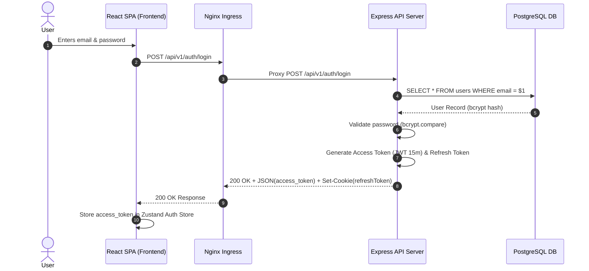
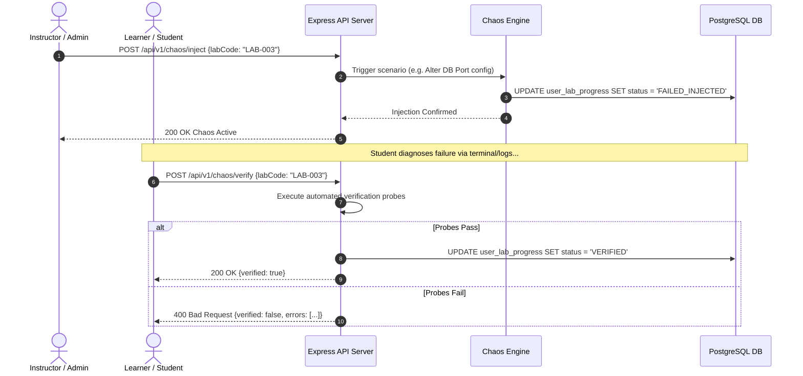

# 09 — Sequence Diagrams Specification

---

## Document Metadata

| Field               | Value                                                             |
|---------------------|-------------------------------------------------------------------|
| **Document Name**   | Sequence Diagrams Specification                                   |
| **Document ID**     | DFIX-ARCH-009                                                     |
| **Version**         | 1.0.0                                                             |
| **Status**          | Approved                                                          |
| **Owner**           | Lead Software Architect                                           |
| **Reviewer**        | Full Engineering Team                                             |
| **Classification**  | Internal — Confidential                                           |
| **Created Date**    | 2026-08-02                                                        |
| **Last Updated**    | 2026-08-06                                                        |
| **Project**         | DeployFix Lab                                                     |
| **Project Code**    | DFIX                                                              |

---

# 1. User Authentication & Token Refresh Sequence

---

# 2. Controlled Chaos Injection & Verification Sequence

