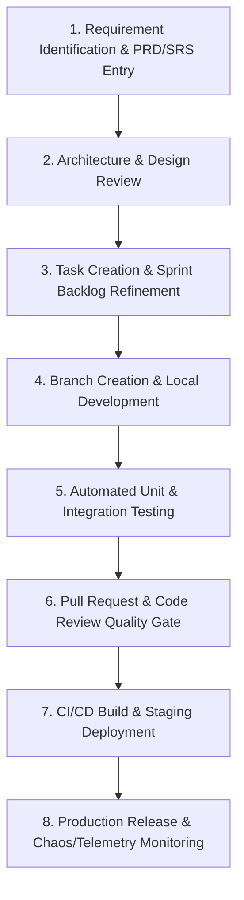

# 01 — Master Development Workflow Specification

---

## Document Metadata

| Field               | Value                                                             |
|---------------------|-------------------------------------------------------------------|
| **Document Name**   | Master Development Workflow Specification                         |
| **Document ID**     | DFIX-FLOW-001                                                     |
| **Version**         | 1.0.0                                                             |
| **Status**          | Approved                                                          |
| **Owner**           | Lead Systems Architect & DevOps Lead                              |
| **Reviewer**        | Full Engineering Team                                             |
| **Classification**  | Internal — Confidential                                           |
| **Created Date**    | 2026-08-02                                                        |
| **Last Updated**    | 2026-08-07                                                        |
| **Project**         | DeployFix Lab                                                     |
| **Project Code**    | DFIX                                                              |

---

# 1. Purpose & Executive Summary

The **Master Development Workflow Specification** defines the end-to-end software development lifecycle (SDLC) for **DeployFix Lab**. It establishes standardized operational phases—from initial requirement identification and architectural design through feature implementation, testing, code review, deployment, and post-release monitoring.

Adhering to this master workflow guarantees high engineering velocity, strict adherence to architectural standards, zero regression deployments, and 100% requirement traceability.

---

# 2. End-to-End Development Lifecycle

---

# 3. Environment Strategy

DeployFix Lab maintains 3 isolated runtime environments:

| Environment | Host Infrastructure | Container State | Primary Purpose |
|---|---|---|---|
| **Local Development** | Developer Laptop / Workstation | Hot-Reloading (`npm run dev`) | Active feature development, local debugging, unit testing. |
| **Docker Staging** | Local / Staging Docker Compose | Containerized (`docker-compose up`) | Multi-container integration testing, failure injection simulation. |
| **Production** | Cloud VPS (EC2/DigitalOcean) | Production Stack via Nginx | Live user lab execution, portfolio presentation, telemetry monitoring. |

---

# 4. Phase-by-Phase Execution Guidelines

## Phase 1: Planning & Definition
* Tasks must be backed by an approved Requirement ID (`FR-XXX` or `NFR-XXX`).
* Tasks must satisfy the **Definition of Ready (DoR)** before sprint allocation.

## Phase 2: Implementation & Coding
* Developers branch off `main` following `03_Naming_Convention.md`.
* Code must follow the 4-Tier Layered Architecture (`Routes` $\rightarrow$ `Controllers` $\rightarrow$ `Services` $\rightarrow$ `Repositories`).

## Phase 3: Verification & Review
* Automated test suite must pass (`npm test`).
* Pull Request opened using `09_Pull_Request_Template.md` and approved by at least 1 peer reviewer.

## Phase 4: Release & Documentation Sync
* Code merged into `main` or `master-trial.Radhesh`.
* Feature commits recorded in their corresponding Domain Work History file (`Frontend Work History.md`, `Backend Work History.md`, `Deployment Work History.md`, etc.).
* Inter-branch merges and PR integrations recorded in `DOCs/Development_History/Commit_History.md`.

