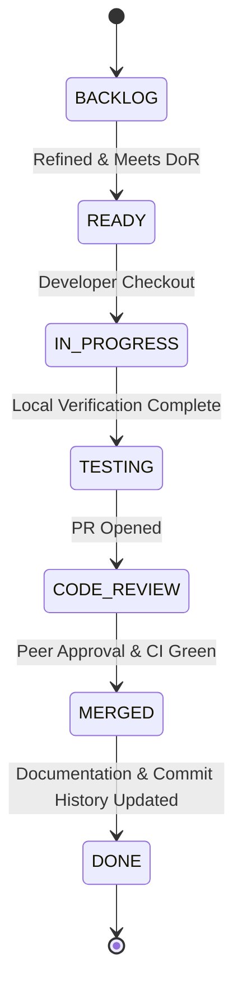

# 02 — Task Execution Workflow

---

## Document Metadata

| Field               | Value                                                             |
|---------------------|-------------------------------------------------------------------|
| **Document Name**   | Task Execution Workflow                                           |
| **Document ID**     | DFIX-FLOW-002                                                     |
| **Version**         | 1.0.0                                                             |
| **Status**          | Approved                                                          |
| **Owner**           | Product Manager & Engineering Lead                                |
| **Reviewer**        | Full Development Team                                             |
| **Classification**  | Internal — Confidential                                           |
| **Created Date**    | 2026-08-02                                                        |
| **Last Updated**    | 2026-08-07                                                        |
| **Project**         | DeployFix Lab                                                     |
| **Project Code**    | DFIX                                                              |

---

# 1. Purpose

The **Task Execution Workflow** defines the standard procedure for picking up, implementing, verifying, and completing individual engineering tasks in **DeployFix Lab**.

---

# 2. Task Lifecycle State Machine



---

# 3. Step-by-Step Task Protocol

1. **Task Assignment:** Pick up task from `READY` queue.
2. **Branch Checkout:** Create task branch from `main`:
   ```bash
   git checkout main
   git pull origin main
   git checkout -b task/DFIX-101-auth-middleware
   ```
3. **Requirement Verification:** Review requirement specification (`03_Functional_Requirements.md`) and acceptance criteria (`08_Acceptance_Criteria.md`).
4. **Development & Self-Test:** Implement code changes and execute tests locally.
5. **PR Submission:** Submit PR using `09_Pull_Request_Template.md`.
6. **Task Completion:** Upon merge, update appropriate `Development_History` logs and `Commit_History.md`.
