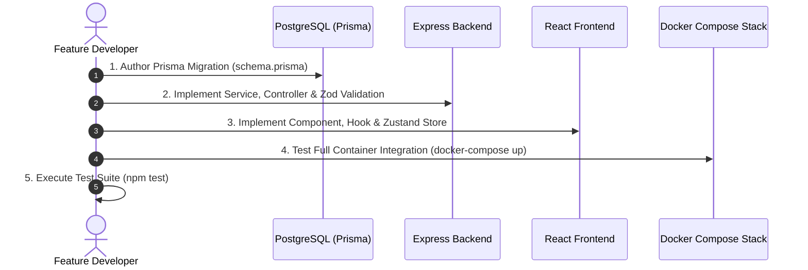

# 03 — Feature Development Workflow

---

## Document Metadata

| Field               | Value                                                             |
|---------------------|-------------------------------------------------------------------|
| **Document Name**   | Feature Development Workflow                                      |
| **Document ID**     | DFIX-FLOW-003                                                     |
| **Version**         | 1.0.0                                                             |
| **Status**          | Approved                                                          |
| **Owner**           | Lead Software Engineer                                            |
| **Reviewer**        | Principal Architect                                               |
| **Classification**  | Internal — Confidential                                           |
| **Created Date**    | 2026-08-02                                                        |
| **Last Updated**    | 2026-08-07                                                        |
| **Project**         | DeployFix Lab                                                     |
| **Project Code**    | DFIX                                                              |

---

# 1. Purpose & Scope

The **Feature Development Workflow** governs end-to-end implementation of new features across full-stack tiers (React Frontend, Express Backend, PostgreSQL DB, Docker Compose, Nginx) for **DeployFix Lab**.

---

# 2. Multi-Tier Feature Development Process

---

# 3. Feature Development Rules

1. **Branch Naming:** Feature branches MUST follow `feat/DFIX-XXX-description` (e.g. `feat/DFIX-042-chaos-injector`).
2. **Schema First:** Any feature requiring database additions MUST start with a Prisma migration script (`npx prisma migrate dev`).
3. **API Contract:** Backend endpoints MUST match specifications in `DOCs/Phase-01/API_Specification.md`.
4. **Environment Isolation:** New configuration parameters MUST be declared in `.env.example`.
