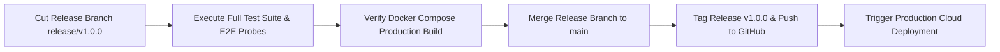

# 05 — Release Management Workflow

---

## Document Metadata

| Field               | Value                                                             |
|---------------------|-------------------------------------------------------------------|
| **Document Name**   | Release Management Workflow                                       |
| **Document ID**     | DFIX-FLOW-005                                                     |
| **Version**         | 1.0.0                                                             |
| **Status**          | Approved                                                          |
| **Owner**           | Release Manager & DevOps Lead                                     |
| **Reviewer**        | Technical Lead                                                    |
| **Classification**  | Internal — Confidential                                           |
| **Created Date**    | 2026-08-02                                                        |
| **Last Updated**    | 2026-08-07                                                        |
| **Project**         | DeployFix Lab                                                     |
| **Project Code**    | DFIX                                                              |

---

# 1. Purpose

The **Release Management Workflow** specifies the steps for staging, tagging, testing, and deploying production releases of **DeployFix Lab** following **Semantic Versioning (SemVer)** principles (`vMAJOR.MINOR.PATCH`).

---

# 2. Release Pipeline

---

# 3. Release Versioning Rules

* **MAJOR (v1.0.0 $\rightarrow$ v2.0.0):** Breaking architectural changes (e.g. migration from Docker Compose to Kubernetes).
* **MINOR (v1.0.0 $\rightarrow$ v1.1.0):** New functional capabilities or lab scenarios added without breaking changes.
* **PATCH (v1.0.0 $\rightarrow$ v1.0.1):** Backward-compatible bug fixes and documentation updates.
