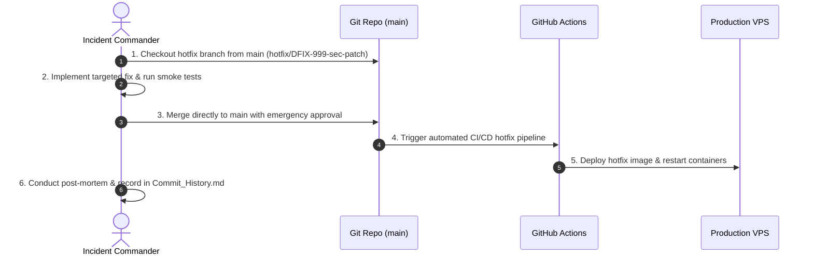

# 06 — Hotfix Workflow

---

## Document Metadata

| Field               | Value                                                             |
|---------------------|-------------------------------------------------------------------|
| **Document Name**   | Hotfix Workflow                                                   |
| **Document ID**     | DFIX-FLOW-006                                                     |
| **Version**         | 1.0.0                                                             |
| **Status**          | Approved                                                          |
| **Owner**           | DevOps Lead & Incident Commander                                  |
| **Reviewer**        | Technical Lead                                                    |
| **Classification**  | Internal — Confidential                                           |
| **Created Date**    | 2026-08-02                                                        |
| **Last Updated**    | 2026-08-07                                                        |
| **Project**         | DeployFix Lab                                                     |
| **Project Code**    | DFIX                                                              |

---

# 1. Purpose

The **Hotfix Workflow** defines the emergency procedure for addressing critical production defects (`P0` severity outages, security vulnerabilities, or database corruption) requiring immediate deployment outside standard sprint release cycles.

---

# 2. Hotfix Execution Lifecycle

---

# 3. Governance & Quality Rules

1. **Scope Restriction:** Hotfixes MUST contain ONLY the minimal code required to resolve the critical incident. Zero feature additions allowed.
2. **Emergency Approval:** Requires explicit sign-off from Technical Lead or DevOps Lead.
3. **Mandatory Post-Mortem:** Root cause analysis MUST be completed within 24 hours of hotfix resolution.
