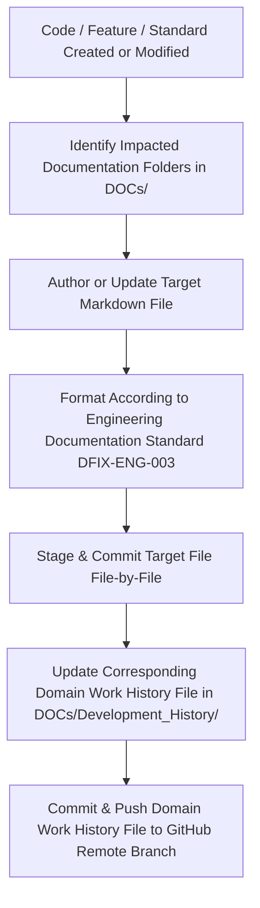

# 08 — Documentation Maintenance Workflow

---

## Document Metadata

| Field               | Value                                                             |
|---------------------|-------------------------------------------------------------------|
| **Document Name**   | Documentation Maintenance Workflow                                |
| **Document ID**     | DFIX-FLOW-008                                                     |
| **Version**         | 1.0.0                                                             |
| **Status**          | Approved                                                          |
| **Owner**           | Documentation Lead & AI Architect                                 |
| **Reviewer**        | Full Engineering Team                                             |
| **Classification**  | Internal — Confidential                                           |
| **Created Date**    | 2026-08-02                                                        |
| **Last Updated**    | 2026-08-07                                                        |
| **Project**         | DeployFix Lab                                                     |
| **Project Code**    | DFIX                                                              |

---

# 1. Purpose & Core Governance

The **Documentation Maintenance Workflow** governs how technical documentation is created, updated, validated, and synchronized across **DeployFix Lab**. In this repository, documentation is managed with the same rigor as production application code (*Documentation as Code*).

---

# 2. Synchronous Documentation Update Pipeline

---

# 3. Mandatory Documentation Rules

1. **Header Metadata:** Every `.md` file in `DOCs/` MUST include standard document metadata (`Document ID`, `Version`, `Status`, `Owner`, `Created Date`, `Last Updated`).
2. **Standard Folder Alignment:** Files MUST be placed inside their designated numbered folders (`01_Project_Management` through `18_AI_Engineering`).
3. **Domain History Routing Rule:** Whenever features, bug fixes, or documentation are committed, update the matching Domain History file:
   - Frontend $\rightarrow$ `Frontend Work History.md`
   - Backend $\rightarrow$ `Backend Work History.md`
   - Deployment $\rightarrow$ `Deployment Work History.md`
   - Database $\rightarrow$ `Database Work History.md`
   - Docker $\rightarrow$ `Docker Work History.md`
   - CI/CD $\rightarrow$ `CI_CD_Work_History.md`
   - Bugs / RCA $\rightarrow$ `Bug History.md`
   - Refactorings $\rightarrow$ `Refactoring History.md`
4. **Commit_History.md Exclusivity:** `Commit_History.md` is strictly reserved for inter-branch merges and PR integrations. Do NOT add individual feature commits here.
5. **File-by-File Git Workflow:** Commits MUST be made file-by-file with clear Conventional Commit messages (e.g. `docs(workflow): add 08_Documentation_Workflow.md`).

