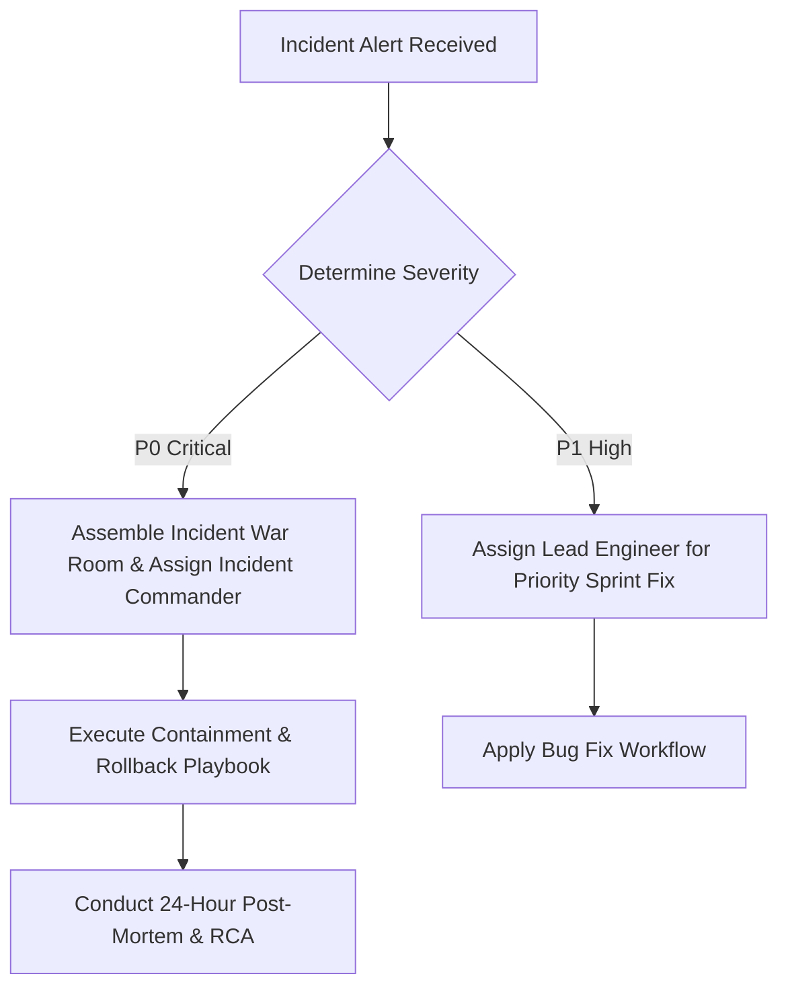

# 08 — Incident Response Playbooks

---

## Document Metadata

| Field               | Value                                                             |
|---------------------|-------------------------------------------------------------------|
| **Document Name**   | Incident Response Playbooks                                       |
| **Document ID**     | DFIX-TB-008                                                       |
| **Version**         | 1.0.0                                                             |
| **Status**          | Approved                                                          |
| **Owner**           | Incident Commander & DevOps Lead                                  |
| **Reviewer**        | Technical Lead                                                    |
| **Classification**  | Internal — Confidential                                           |
| **Created Date**    | 2026-08-02                                                        |
| **Last Updated**    | 2026-08-07                                                        |
| **Project**         | DeployFix Lab                                                     |
| **Project Code**    | DFIX                                                              |

---

# 1. Incident Response Triage Procedure

