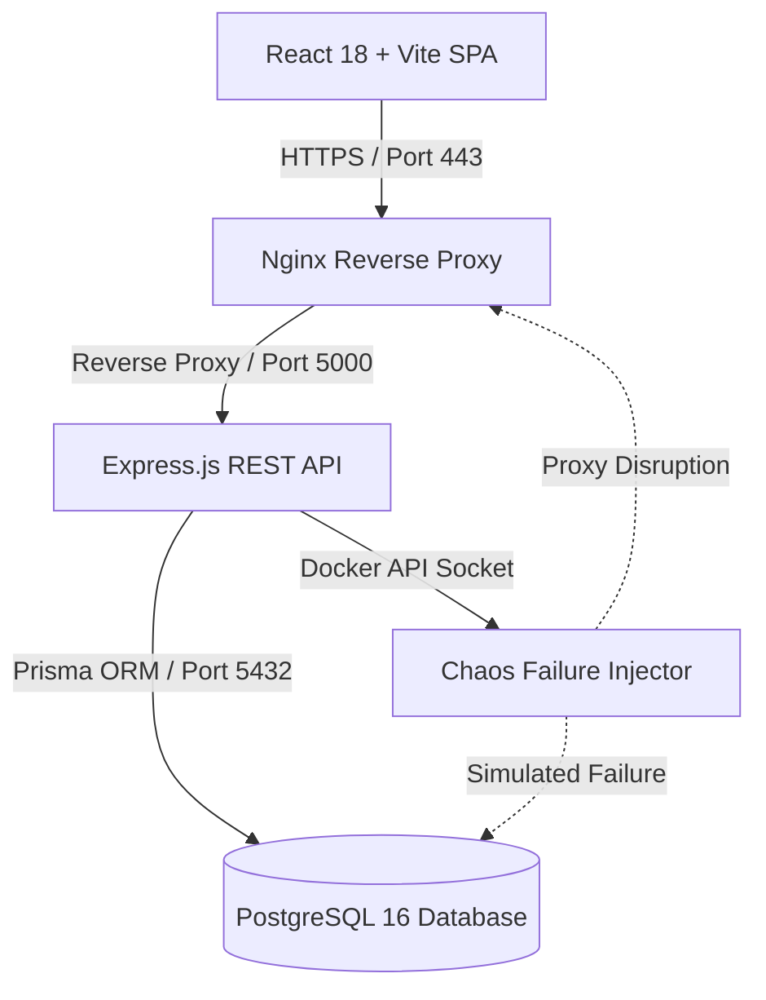

# 03 — Deep-Dive System Architecture Showcase

---

## Document Metadata

| Field               | Value                                                             |
|---------------------|-------------------------------------------------------------------|
| **Document Name**   | Deep-Dive System Architecture Showcase                            |
| **Document ID**     | DFIX-PORT-003                                                     |
| **Version**         | 1.0.0                                                             |
| **Status**          | Approved                                                          |
| **Owner**           | Lead Software Architect                                           |
| **Reviewer**        | Technical Lead                                                    |
| **Classification**  | Public / Portfolio                                                |
| **Created Date**    | 2026-08-02                                                        |
| **Last Updated**    | 2026-08-09                                                        |
| **Project**         | DeployFix Lab                                                     |
| **Project Code**    | DFIX                                                              |

---

# 1. Architectural Deep-Dive

**DeployFix Lab** is built around an enterprise-grade multi-container architecture enforcing strict separation of concerns, stateless application processing, and isolated container networking.

---

# 2. Key Architecture Design Decisions

1. **Multi-Stage Docker Builds:** Standardized 3-stage Dockerfiles (`Deps` -> `Builder` -> `Runner`) using `node:20-alpine` base images, keeping final runner containers under 120MB and execution strictly unprivileged (`USER nodejs`).
2. **Stateless API & JWT Authentication:** API nodes maintain zero in-memory session state; authentication uses short-lived JWT access tokens accompanied by HttpOnly, SameSite refresh cookies stored in PostgreSQL.
3. **Bridge Network Isolation:** All backend components communicate exclusively over `dfix-net`, an internal Docker bridge network. Only Nginx exposes host ports (80/443), protecting database and API ports from external exposure.
4. **Chaos Injection via Docker API:** Chaos engine triggers targeted container disruptions by interacting directly with the Docker daemon API socket in an isolated lab context.
