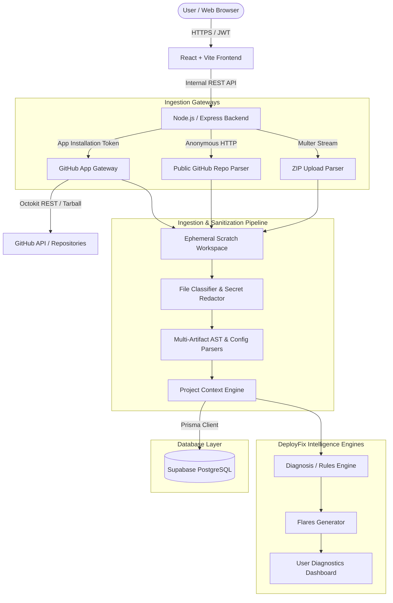
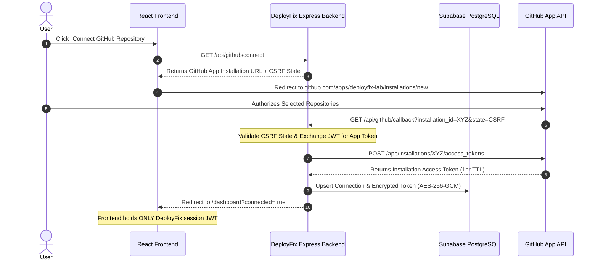

# DeployFix Lab — GitHub Repository Integration: Architecture & System Design

| Property | Value |
| :--- | :--- |
| **Document Name** | GitHub Repository Integration Architecture & System Design |
| **Document ID** | DFL-GH-ARCH-001 |
| **Version** | 1.0.0 |
| **Status** | Approved |
| **Category** | Technical Architecture |
| **Owner** | DeployFix Lab Core Architecture Team |
| **Created On** | 2026-08-17 |
| **Last Updated** | 2026-08-17 |
| **Repository** | DeployFix Lab (`Radheshbhuva/DeployFixLab`) |

---

## 1. Architectural Principles & Constraints

DeployFix Lab is architected under strict constraints that preserve security, user experience, and scalability:

```text
┌─────────────────────────────────────────────────────────────────────────┐
│                          ARCHITECTURAL BOUNDARIES                       │
│                                                                         │
│  1. Pure SaaS Web Platform: Zero desktop binaries, zero agent CLI.      │
│  2. Strict Security Proxy: Frontend never accesses GitHub with secrets. │
│  3. Zero Dynamic Code Execution: Repository source is never run.        │
│  4. Ephemeral Workspace: Code is parsed in RAM/temp disk, then wiped.   │
│  5. Structured Persistence Only: Supabase stores Context/Flares only.   │
└─────────────────────────────────────────────────────────────────────────┘
```

---

## 2. High-Level System Architecture



---

## 3. Integration Modalities Comparison

DeployFix Lab supports a primary authenticated pathway alongside fallback mechanisms to guarantee 100% onboarding coverage:

| Method | Role | Target Use Case | Permissions Scope | Pros | Cons |
| :--- | :--- | :--- | :--- | :--- | :--- |
| **GitHub App** *(Primary)* | Primary Authenticated | Private & Public user repos | `metadata:read`, `contents:read` (selected repos) | Fine-grained repo selection, granular webhook events, secure tokens | Requires user App installation step |
| **Public Repo URL** *(Fallback 1)* | Instant Inspection | Open-source repos, tutorials, demos | None (Anonymous or server PAT) | Zero friction, instant 1-click analysis | Public repositories only |
| **ZIP Upload** *(Fallback 2)* | Airgapped / Local | Local folders, strict enterprise policies | None | Bypasses GitHub authorization entirely | No automated git sync / webhook updates |
| **GitHub Webhooks** *(V2 Sync)* | Continuous Ingestion | Push events to connected branches | Repository Webhook (`push`) | Continuous context freshness & proactive Flares | Requires public endpoint & secret validation |

---

## 4. Security Boundary & Token Isolation



> [!CAUTION]
> **Zero Token Leakage Rule:** Under no circumstances is the `installation_access_token` or GitHub App Private Key ever returned to the client browser. All GitHub requests are routed through backend service handlers.

---

## 5. Ingestion Pipeline & Workspace Lifecycle

```text
1. INITIATE: Backend receives repository scan trigger (repoId, branch/commit).
2. SCRATCH ALLOCATION: Backend allocates /tmp/deployfix/scans/<scan_id>/ (or OS temp).
3. FETCH SNAPSHOT: Octokit streams tarball archive directly into memory/temp file.
4. SANITIZE & DECOMPRESS:
   - Tarball extract limit: max 5,000 files, max 200MB uncompressed, max depth 10.
   - Symlinks are resolved safely and not followed outside workspace root.
5. CLASSIFY & SCRUB:
   - Match against SENSITIVE_BLACK_LIST (.env, *.pem, *.key, id_rsa, id_ed25519).
   - Scrub suspected secret patterns via regex prior to memory ingestion.
6. TARGETED PARSING:
   - package.json / package-lock.json / pnpm-lock.yaml / yarn.lock
   - Dockerfile / docker-compose.yml / compose.yaml
   - nginx.conf / default.conf
   - .env.example (structure and keys only, no values)
   - prisma/schema.prisma
   - .github/workflows/*.yml
   - Project directory tree (names and paths only)
7. AGGREGATE PROJECT CONTEXT:
   - Compute language, framework, runtime, container, proxy, database, and CI flags.
8. PERSIST CONTEXT:
   - Write structured JSON to Supabase PostgreSQL via Prisma `project_context` table.
9. SCRATCH CLEANUP:
   - Execute secure synchronous wipe of `/tmp/deployfix/scans/<scan_id>/`.
```

---

## 6. Project Context Data Model & Relationship

The repository source feeds directly into structured tables without bloating the database with file contents:

```mermaid
erDiagram
    GITHUB_CONNECTIONS ||--o{ REPOSITORIES : owns
    REPOSITORIES ||--o{ REPOSITORY_SCANS : triggers
    REPOSITORY_SCANS ||--|| PROJECT_CONTEXT : generates
    PROJECT_CONTEXT ||--o{ DIAGNOSTICS : yields
    DIAGNOSTICS ||--o{ FLARES : triggers

    GITHUB_CONNECTIONS {
        string id PK
        string userId FK
        bigint installationId
        string githubAccount
        string encryptedToken
        datetime createdAt
    }

    REPOSITORIES {
        string id PK
        string connectionId FK
        bigint githubRepoId
        string owner
        string name
        string defaultBranch
        string visibility
        string url
        datetime lastSyncedAt
    }

    REPOSITORY_SCANS {
        string id PK
        string repositoryId FK
        string commitSha
        string branch
        string status
        datetime startedAt
        datetime completedAt
    }

    PROJECT_CONTEXT {
        string id PK
        string scanId FK
        string repositoryId FK
        jsonb languages
        string frontendFramework
        string backendFramework
        string databaseEngine
        string orm
        boolean dockerDetected
        boolean nginxDetected
        boolean ciDetected
        jsonb artifactsFound
        jsonb rawTreeSummary
    }

    DIAGNOSTICS {
        string id PK
        string contextId FK
        string ruleId
        string severity
        string category
        string fileAffected
        jsonb evidence
    }

    FLARES {
        string id PK
        string diagnosticId FK
        string title
        string description
        string rootCause
        string suggestedFix
        string status
    }
```



---

## 7. Downstream Intelligence Integration

The generated `Project Context` is a reusable, schema-validated artifact consumed across three platform engines:

1. **Flares & Diagnosis Engine:**
   - Evaluates multi-source evidence (e.g., `Dockerfile` exposes port `5000` while `nginx.conf` proxies to port `3000` -> **Port Mismatch Flare**).
   - Validates `.env.example` keys against deployment environment variables.
2. **Suggested Builders:**
   - Detects architecture (e.g., React + Express + Prisma + Docker) and matches against builder templates.
3. **Suggested Projects:**
   - Generates curated practice scenarios and chaos engineering drills based on the detected stack.
