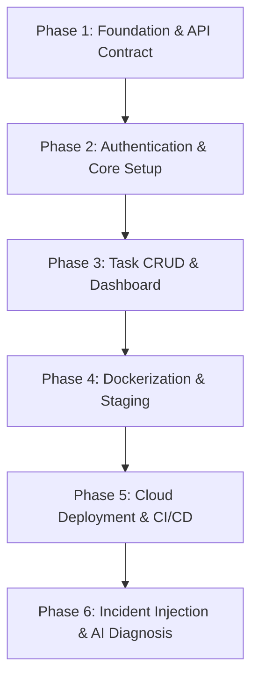

# DeployFix Lab — Team Project Phase Plan & Git Workflow Guide

Welcome to the project management blueprint for **DeployFix Lab**. Since you are working in a team of three with dedicated roles, this document outlines how to structure the project phases, how you (the Backend Developer) can start immediately in parallel, and how the team should manage code using Git.

---

## 👥 Team Roles & Responsibilities

| Role | Developer | Key Focus Areas |
| :--- | :--- | :--- |
| **Backend & Database** | **You** | API Contracts, Node.js + Express, PostgreSQL, Prisma ORM, Zod validation, JWT Auth logic, AI context schemas, and Diagnosis integration. |
| **Frontend** | **Partner 1** | React UI, TypeScript, Vite, Tailwind CSS routing, pages (Login, Dashboard, Tasks), state management, and mock API integration. |
| **DevOps & Deployment** | **Partner 2** | Git repository architecture, CI/CD pipelines, Docker containerization, Nginx reverse proxy, cloud deployment, and system telemetry/monitoring. |

---

## 📅 Project Phases (Execution Strategy)

To build DeployFix Lab successfully, the project is divided into **6 logical phases**. 



### Phase 1: Foundation & API Contract
* **Objective:** Standardize the code repositories, configurations, database models, and API interfaces before any major coding begins.
* **Backend Role (You):** Write the database schema (`schema.prisma` with User & Task models) and design the REST API contract specifications (JSON endpoints, headers, status codes, and request/response shapes).
* **Frontend Role:** Set up React with TypeScript and Vite. Design static UI layouts and input fields, using static mock data for any dynamic components.
* **DevOps Role:** Initialize the repository, branch protection rules, configure ESLint/Prettier, and set up a basic GitHub Actions CI check.

### Phase 2: Authentication & Core Setup
* **Objective:** Establish a secure foundation where users can register, login, and access protected application areas.
* **Backend Role (You):** Implement `/api/auth/register` and `/api/auth/login` endpoints. Configure password hashing with bcrypt, token generation with JSON Web Tokens (JWT), and write authorization middleware.
* **Frontend Role:** Build the Login and Registration screens, hook up authentication forms, and implement router protection (redirecting unauthorized guests away from the Dashboard).
* **DevOps Role:** Set up environment variable standards (`.env.example`) and configure runtime configurations for local execution.

### Phase 3: Task Management & Dashboard (Vertical Slice)
* **Objective:** Deliver a working full-stack application (the **DevOps Task Manager**) containing all core user features.
* **Backend Role (You):** Implement CRUD operations for Tasks (`GET /api/tasks`, `POST /api/tasks`, etc.) with pagination, filter, search, Zod request body validation, and structured error handling. Write the `/api/dashboard` statistics endpoint.
* **Frontend Role:** Build the Task List UI, Task forms (create/edit modals), search/filter controls, and hook them up to the real API endpoints.
* **DevOps Role:** Write test verification scripts and help organize database seed files for testing.

### Phase 4: Containerization & Staging
* **Objective:** Wrap the working application in isolated Docker containers, simulating a multi-service production environment.
* **Backend Role (You):** Refactor the backend connection strings to adapt to Docker environments (using dynamic database environment variables) and write the health checks (`/health`, `/live`, `/ready`).
* **Frontend Role:** Optimize the frontend build process for production server hosting (e.g., serving static files via Nginx).
* **DevOps Role:** Write multi-stage Dockerfiles for frontend/backend, configure PostgreSQL container with volumes for persistence, set up Nginx as a reverse proxy, and tie them together with `docker-compose.yml`.

### Phase 5: CI/CD & Production Deployment
* **Objective:** Automated build, test, and deployment of the application to cloud hosting platforms.
* **Backend Role (You):** Write integration test suites to verify server and database connectivity in cloud environments.
* **Frontend Role:** Ensure the production bundle is light and error-free.
* **DevOps Role:** Create a GitHub Actions workflow to build Docker images on push, run tests, and automatically deploy the services (e.g., frontend on Vercel/Render, backend and database on Cloud VPS/Render).

### Phase 6: Incident Injection & AI Diagnosis (The DeployFix Lab)
* **Objective:** Integrate the actual DeployFix engine to detect, diagnose, and recover from simulated deployment failures.
* **Backend Role (You):** Implement the AI Diagnosis schemas (`ai/schemas/context.schema.ts`, `ai/schemas/evidence.schema.ts`, and `ai/schemas/diagnosis.schema.ts`). Write code to aggregate evidence payload data (server logs, health checks) to send to the diagnosis LLM prompt system.
* **Frontend Role:** Create the DeployFix Admin dashboard where developers can see diagnostic reports, confidence levels, root cause explanations, and guided recovery actions.
* **DevOps Role:** Script system failures (e.g., disconnecting backend from database, shutting down containers, using invalid environment variables) to test the Diagnosis Engine.

---

## ⚡ How You (Backend) Can Start Development Immediately

> [!IMPORTANT]
> **You do NOT need to wait for the frontend developer.** 
> Waiting for the frontend to be finished before starting the backend is a classic anti-pattern that leads to integration delays, mismatch in schemas, and bugs. Instead, your team will follow an **API-Contract-First & Parallel Development** model.

### Your Parallel Path Action Plan:
1. **Agree on the API Contract First (Day 1):**
   * Meet with the Frontend Developer. Agree on the REST endpoints (e.g., `/api/auth/login`, `/api/tasks`).
   * Define the exact request JSON body and response JSON structure (including success and error states).
   * Put this in a markdown file in your docs (e.g., [API_Specification.md](file:///d:/Coding/OST/Project/DeployFixLab/DOCs/09_API/API_Specification.md)).
2. **Develop the Database & Express Server Independently:**
   * Write the Prisma models in `schema.prisma` and run migrations locally to generate your PostgreSQL tables.
   * Write Express routes, business logic in services, and validation rules using Zod.
3. **Verify the Backend Independently:**
   * Do not wait for a UI to test your endpoints. Use tools like **Postman**, **Thunder Client**, or **curl** to hit your endpoints with various test payloads.
   * Write automated tests using **Vitest** (already in your `package.json` devDependencies) to verify your CRUD logic, authentication tokens, and validation checks.
4. **Mocking on the Frontend Side:**
   * While you build the backend, the Frontend Developer can use a mock server (like `json-server`, MSW, or simple hardcoded JavaScript latency wrappers) that returns data matching the agreed API contract.
5. **Integration Phase:**
   * Once you finish the backend endpoints and they finish the UI screens, swap the frontend's API URL from the mock server to your local server (`http://localhost:5000/api`). Integration will take minutes rather than days because you both followed the contract.

---

## 🛠️ Team Git Workflow & Commands Cheat Sheet

To keep your code history clean, use the standard workflow: **main ➔ develop ➔ feature branches**.

```
  main (Production)    [v1.0.0] ───────────────────────● (Stable Tag)
                           ▲
                           │ Release PR
                           │
develop (Integration)  ●───●───────●───────────────────●
                        \         / \                 /
                         \       /   \               /
 feature branches         ●─────●     ●─────────────●
                        feature/auth    feature/tasks
```

### Git Branching Conventions:
* `main`: Strictly reserved for stable, production-ready releases. Never commit directly.
* `develop`: The main integration branch where team members merge their features.
* `feature/<feature-name>`: Temporary branch for implementing a specific feature.
* `bugfix/<bug-name>`: Temporary branch for fixing a bug.
* `docs/<doc-topic>`: Temporary branch for updating docs.

---

### Step-by-Step Git Commands:

#### 1. Starting a New Feature (e.g., Backend Auth)
Always start by syncing your local repository with the remote server, switching to `develop`, pulling the latest changes, and spawning your new feature branch:
```bash
# Move to develop and pull latest team updates
git checkout develop
git pull origin develop

# Create and switch to your feature branch
git checkout -b feature/auth-backend
```

#### 2. Local Work & Commit Rules
As you write code, commit frequently (e.g., whenever a single controller or helper is done, rather than waiting for the whole feature to be finished).
* **Format:** `<type>: <short description>`
* **Types:** `feat` (new feature), `fix` (bug fix), `docs` (doc updates), `test` (tests), `refactor` (code improvement), `chore` (configs, dependencies).

```bash
# Check status of modified files
git status

# Stage the specific file changes
git add src/controllers/auth.controller.ts src/services/auth.service.ts

# Commit using clean imperative style
git commit -m "feat: implement registration controller and validation"
```

#### 3. Syncing with Teammates (Pulling Updates)
If another teammate merges their code into `develop` while you are still working on your branch, you should pull their updates to prevent conflicts later:
```bash
# Fetch latest remote changes
git fetch origin

# Merge the latest develop changes into your feature branch
git merge origin/develop
# (Resolve any merge conflicts locally, then commit the resolution)
```

#### 4. Sharing Your Code & Opening a Pull Request
When your feature is complete and local tests pass, push your branch to GitHub and open a Pull Request (PR) to merge into `develop`.
```bash
# Push your branch to remote repository
git push origin feature/auth-backend
```
* **Actions on GitHub:**
  1. Open GitHub and navigate to the repository.
  2. Click **New Pull Request**.
  3. Set base: `develop` ➔ compare: `feature/auth-backend`.
  4. Fill out the PR template, explain what you did, and tag your team members for review.

#### 5. Merging & Releasing to Main
Once code reviews pass and tests succeed on the PR:
1. Merge the PR on GitHub into `develop`.
2. Delete the remote feature branch.
3. Locally, pull the merged code down:
   ```bash
   git checkout develop
   git pull origin develop
   git branch -d feature/auth-backend # Clean up local branch
   ```
4. **Releasing to Main:** At the end of a sprint, when `develop` is fully validated and stable:
   * Open a PR from `develop` into `main`.
   * Once approved and merged, tag the release:
     ```bash
     git checkout main
     git pull origin main
     git tag -a v1.0.0-baseline -m "Release of Phase 1 stable baseline"
     git push origin v1.0.0-baseline
     ```

---

## 💡 Quick Tips for Success
* **Never commit secret keys:** Keep credentials like database passwords, JWT secrets, and API tokens in a `.env` file that is listed in `.gitignore`. Provide empty placeholders in `.env.example`.
* **Resolve conflicts locally:** If you get a conflict during merging, read the file carefully. Keep the valid lines from both sides, remove the conflict markers (`<<<<<<<`, `=======`, `>>>>>>>`), compile/test your code, and commit.
* **Keep PRs small:** Try to keep PRs focused. It is much easier for your teammate to review a 100-line change than a 1500-line change!
