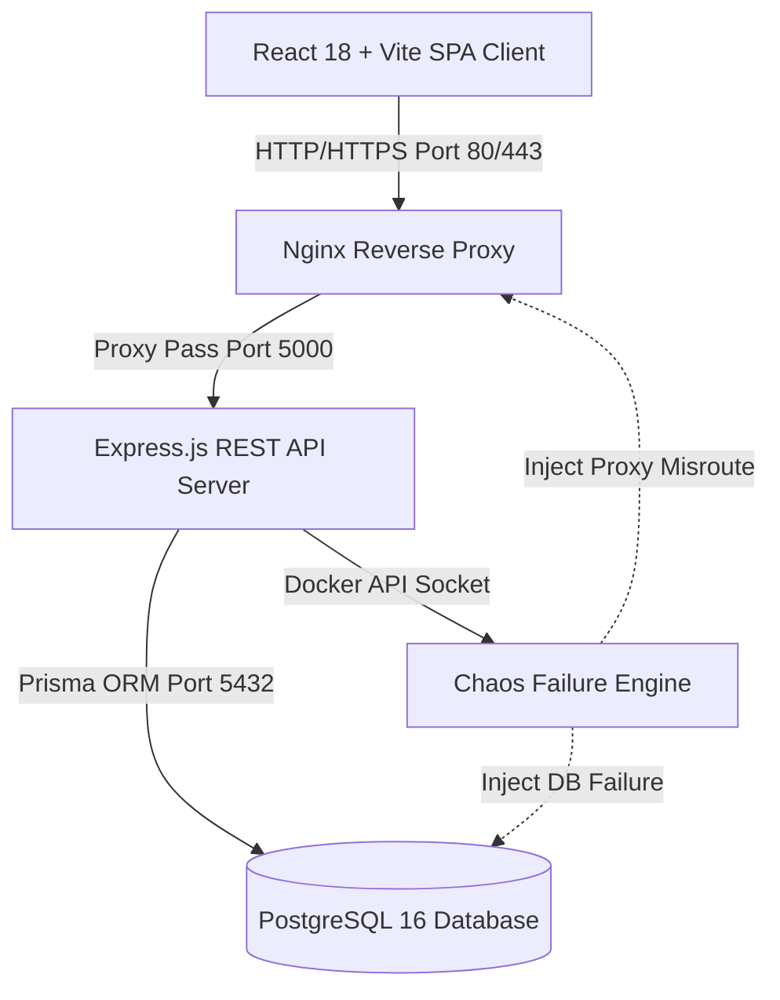

# DeployFix Lab 🚀

> **An Interactive Production Deployment Troubleshooting & Container Chaos Engineering Laboratory for DevOps and Cloud Engineers**

[](https://github.com/Radheshbhuva/DeployFixLab/actions)
[](https://reactjs.org/)
[](https://nodejs.org/)
[](https://www.postgresql.org/)
[](https://www.docker.com/)
[](LICENSE)
[](DOCs/12_Docker/Security.md)

---

## 📋 Table of Contents

- [Overview](#-overview)
- [Why DeployFix Lab?](#-why-deployfix-lab)
- [How It Works](#-how-it-works)
- [System Architecture](#-system-architecture)
- [Tech Stack](#-tech-stack)
- [Built-In Chaos Lab Scenarios](#-built-in-chaos-lab-scenarios)
- [Quickstart Guide](#-quickstart-guide)
- [Documentation Suite Index](#-documentation-suite-index)
- [Security & Hardening](#-security--hardening)
- [License & Author](#-license--author)

---

## 📌 Overview

**DeployFix Lab** is an open-source, full-stack web application and DevOps chaos engineering platform designed to bridge the gap between theoretical cloud learning and real-world production incident response.

Unlike standard tutorial applications that only focus on greenfield deployments, **DeployFix Lab** intentionally injects infrastructure anomalies—such as database connection pool starvation, proxy routing mismatches, memory leaks, and broken environment variables—into an isolated multi-container stack. Users inspect real-time container stdout logs, diagnose failures using structured telemetry, and submit fixes to earn verification badges.

---

## 💡 Why DeployFix Lab?

In production environments, engineering outages rarely happen due to basic syntax errors. They happen because of:
- **Upstream Network Dropouts** & DNS misconfigurations
- **Database Connection Leaks** under high concurrent load
- **Nginx Reverse Proxy Mismatches** and header stripping
- **Unbounded Memory Accumulation** leading to Linux OOM Kills (`Exit Code 137`)

**DeployFix Lab** provides a safe, sandbox environment where developers, Site Reliability Engineers (SREs), and DevOps students can practice diagnosing and fixing real failure modes without risking production downtime.

---

## ⚙️ How It Works

```
┌─────────────────────────┐      ┌──────────────────────────┐      ┌──────────────────────────┐      ┌──────────────────────────┐
│  1. Chaos Engine        │      │  2. Telemetry & Logs     │      │  3. Code/Config Fix      │      │  4. Verification Probe   │
│  Injects targeted       │ ───► │  Student inspects live   │ ───► │  Student applies fix     │ ───► │  Automated health probe  │
│  container failure      │      │  Winston logs & metrics  │      │  via Git / Docker CLI    │      │  verifies system state   │
└─────────────────────────┘      └──────────────────────────┘      └──────────────────────────┘      └──────────────────────────┘
```

1. **Failure Injection:** An instructor or student triggers a chaos scenario (`LAB-001` through `LAB-004`).
2. **Real-Time Telemetry:** The platform streams container stdout/stderr logs and health metrics directly to the user dashboard via WebSockets.
3. **Diagnosis & Remediation:** The student identifies the root cause using log correlation IDs and applies a fix to the container configuration or codebase.
4. **Automated Verification:** Automated health probes execute synthetic traffic tests against the environment and award a verified badge upon success.

---

## 🏗️ System Architecture

DeployFix Lab operates as a multi-container micro-services stack orchestrated with Docker Compose:



All internal services communicate over an isolated Docker bridge network (`dfix-net`), exposing only ports 80 and 443 to the host interface.

---

## 🛠️ Tech Stack

| Component | Technologies & Frameworks | Description |
|---|---|---|
| **Frontend** | React 18, Vite, TypeScript 5.4, Tailwind CSS, Zustand | Responsive SPA with real-time log stream rendering and dark mode. |
| **Backend** | Node.js 20 LTS, Express.js 4.19, TypeScript 5.4 | Layered 4-Tier RESTful API with Zod payload validation. |
| **Database** | PostgreSQL, Prisma ORM, Supabase PostgreSQL | PostgreSQL relational engine accessed via Prisma Client; Dockerized PostgreSQL locally, Supabase PostgreSQL in cloud environments. Developer inspection via Prisma Studio (`npx prisma studio`), cloud administration via Supabase Dashboard. |
| **Containers** | Docker Compose v2, Alpine Linux, Nginx Ingress | Multi-stage, non-root hardened container stack. |
| **Observability** | Winston Logger, Morgan, WebSockets | Single-line JSON logging with correlation ID tracking. |
| **Quality & CI** | Jest, Supertest, Vitest, Playwright, GitHub Actions | Automated unit, API integration, E2E, and linting pipelines. |

---

## 🧪 Built-In Chaos Lab Scenarios

| Scenario ID | Name | Category | Difficulty | Description |
|---|---|---|---|---|
| **`LAB-001`** | DB Connection Depletion | Database | Intermediate | Exhausts PostgreSQL connection pool; requires pool tuning in Prisma. |
| **`LAB-002`** | Nginx Proxy Mismatch | Networking | Beginner | Misconfigures upstream proxy port; results in `502 Bad Gateway`. |
| **`LAB-003`** | Missing Env Variable | Configuration | Beginner | Strips `JWT_SECRET`; causes API crashes on authentication requests. |
| **`LAB-004`** | Container Memory Leak | Reliability | Advanced | Unbounded heap expansion leading to Linux OOM Kill (`Code 137`). |

---

## 🚀 Quickstart Guide

### Prerequisites
- [Docker Desktop](https://www.docker.com/products/docker-desktop/) or Docker Engine `v24.0+` & Docker Compose `v2+`
- Git `v2.40+`

### 1. Clone the Repository
```bash
git clone https://github.com/Radheshbhuva/DeployFixLab.git
cd DeployFixLab
```

### 2. Configure Environment Variables
```bash
cp .env.example .env
```

### 3. Launch the Container Stack
```bash
docker-compose up -d --build
```

### 4. Access the Application
- **Frontend Dashboard:** [http://localhost](http://localhost)
- **API Health Check:** [http://localhost/api/v1/health/liveness](http://localhost/api/v1/health/liveness)
- **OpenAPI Docs:** [http://localhost/api/v1/docs](http://localhost/api/v1/docs)

---

## 📚 Documentation Suite Index

DeployFix Lab contains an exhaustive 17-module technical documentation library located in the [`DOCs/`](DOCs/) directory:

- 📂 **[`01_Project_Management`](DOCs/01_Project_Management/)** — Project Charter, Vision, Roadmap, Checklists.
- 📂 **[`02_Requirements`](DOCs/02_Requirements/)** — SRS, Acceptance Criteria, Traceability Matrix.
- 📂 **[`03_Architecture`](DOCs/03_Architecture/)** — System, Frontend, Backend, Cloud & Database Architecture.
- 📂 **[`04_Engineering_Standards`](DOCs/04_Engineering_Standards/)** — Code Style, Naming Conventions, Review Checklists.
- 📂 **[`05_AI_Development_System`](DOCs/05_AI_Development_System/)** — AI Workflows, Debugging & Prompt History.
- 📂 **[`06_Development_History`](DOCs/Development_History/)** — Git Audit Trail & Master Commit History Log.
- 📂 **[`07_Development_Workflow`](DOCs/07_Development_Workflow/)** — Branching, PRs, Release & Hotfix Workflows.
- 📂 **[`08_Database`](DOCs/08_Database/)** — 3NF Design, ER Diagram, Prisma Schema, Migration Guide.
- 📂 **[`09_API`](DOCs/09_API/)** — OpenAPI 3.0 Specs, Response Format, Auth API, Error Codes.
- 📂 **[`10_Frontend`](DOCs/10_Frontend/)** — React Architecture, Routing, Design Tokens, Zustand Stores.
- 📂 **[`11_Backend`](DOCs/11_Backend/)** — Express Guidelines, Middleware Pipeline, Winston Logging.
- 📂 **[`12_Docker`](DOCs/12_Docker/)** — Multi-Stage Builds, Compose Guide, Security Hardening.
- 📂 **[`13_Testing`](DOCs/13_Testing/)** — Testing Strategy, API & E2E Testing, Pre-Release Regression.
- 📂 **[`14_Deployment`](DOCs/14_Deployment/)** — Production Manual, VPS Provisioning, Disaster Recovery.
- 📂 **[`15_Troubleshooting`](DOCs/15_Troubleshooting/)** — Failure Catalogs, Incident Playbooks, 5-Whys RCA.
- 📂 **[`16_Portfolio`](DOCs/16_Portfolio/)** — Portfolio Showcase, Screenshots, Presentation Slide Deck.
- 📂 **[`17_Templates`](DOCs/17_Templates/)** — Standardized ADR, Feature, Bug, and Incident Templates.

---

## 🔒 Security & Hardening

DeployFix Lab adheres to cloud-native security best practices:
- **Unprivileged Execution:** All containers run under dedicated non-root user accounts (`UID 10001`).
- **Read-Only Root Filesystem:** Container filesystems are mounted read-only (`read_only: true`) with `tmpfs` mounts for temporary buffers.
- **Capability Dropping:** Unnecessary Linux kernel capabilities are explicitly dropped (`cap_drop: [ALL]`).
- **No In-Image Secrets:** Sensitive credentials are provided dynamically at runtime via environment variables.

---

## 📄 License & Author

- **Author:** Radhesh Bhuva ([@Radheshbhuva](https://github.com/Radheshbhuva))
- **Repository:** [https://github.com/Radheshbhuva/DeployFixLab](https://github.com/Radheshbhuva/DeployFixLab)
- **License:** Released under the [MIT License](LICENSE).
